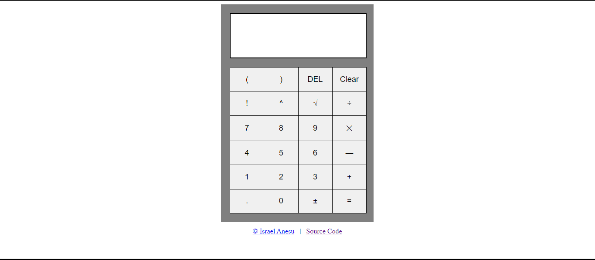

<!-- PROJECT LOGO -->

  
    

<h3 align="center">Calculator App</h3>

  

    For Simple Arithmetic Calculations
     
     
    <a href="https://israel-anesu.github.io/Calculator/">View Live Demo</a>    
  

 

<!-- ABOUT THE PROJECT -->
## Preview

 

### Built With

- HTML5   
- CSS3  
- JavaScript

### Tools Used

- Google   
- Git
- GitHub  
- Visual Studio Code 

 

## Features

- A Simple Calculator which is built with Modern Javascript practices  
- It can evaluate expressions for Multiplication, Division, Subraction, Addition & Modulo Division 
- Clean UI for better visuals
- Responsive for both Desktop & Mobile

 

## Usage

- 
 
For Mobile

  - ### General
    - Click the visual buttons to use Calculator

- 
 
For Desktop

  - ### General
    - You can also click visual buttons for access
    - Refer additional information below
  - ### Additional 
    - `Keyboard Supported`
    - `Backspace Key`: Deletes a value
    - `Enter Key`: Show the Result
    - `0-9 Keys`: Takes input for Numbers
    - `'C' Key`:  Clears the Display
    - `Operation Keys`: Operates with operands

 

## Outcome

* Used HTML5 **semantic elements** for better readability and structure
* Used CSS3 **grid** and **flex** to manage layout
* Used **Data-Attributes** for accessing DOM Elements
* Used **Git** and **GitHub** for project management
* Tried to maintain **clean code**
* **Cross tested** on Firefox and Chromium based browsers

 

## What I learned

* Practicality and usability of **Javascript**
* Learned to add **keyboard support** with event listeners

 

<!-- ACKNOWLEDGMENTS -->
## Acknowledgments

* Inspiration by https://www.theodinproject.com/

 

<!-- LICENSE -->
## License

- Distributed under the MIT License.

 

<!-- CONTACT -->
## Author

